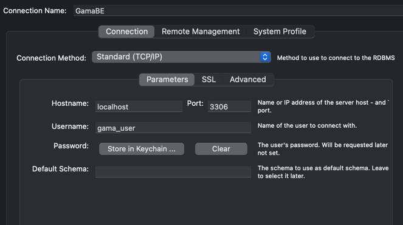

git clone https://gitlab.com/namtranpt00/gamabe.git

install docker desktop

docker-compose build

docker-compose up -d

open mysql workbench with similar below config 

username and password: gama_user

import db from file GamaBE.sql